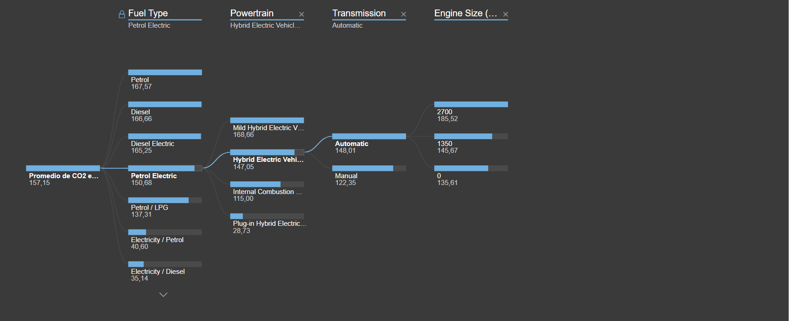
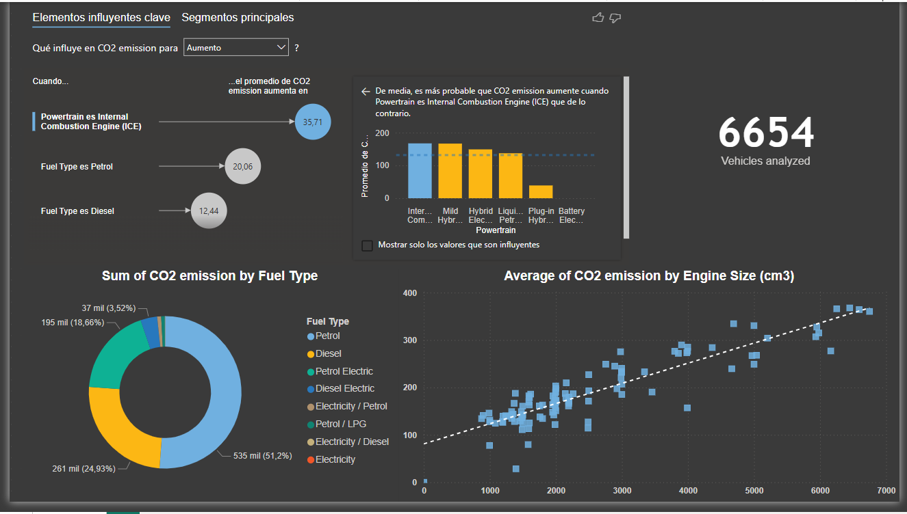

# Root Cause Analysis of CO2 Vehicle Emissions

## Introduction
In this project, I focused on analyzing CO2 vehicle emissions, a significant environmental concern. Using Power BI, I explored a dataset to uncover the factors that impact emissions the most. The goal was to create an insightful report that includes advanced visualizations like Key Influencers and a Decomposition Tree to identify patterns and find the root causes behind vehicle emissions.

## Approach

1. **Getting Started with the Dataset**  
   I began by opening the `CO2 emissions by vehicle` Power BI file and familiarized myself with the data. This included identifying the key column for CO2 emissions and related attributes, while filtering out irrelevant columns to keep the report clean and focused.

2. **Creating the Report**  
   - **Dataset Overview:** I added a card visual to display the total number of vehicles analyzed in the dataset. This gives a quick snapshot of the data volume.  
   - **Key Influencers:** Using this visual, I highlighted the factors that have the biggest impact on emissions. The visual also generated scatter plots that I recreated in the report to make the findings clearer.  

3. **Exploring Top Segments**  
   - To dive deeper, I used the Top Segments tool to group the influencing factors. This allowed me to identify patterns and relationships between attributes affecting emissions.
   - I noticed that some factors were so impactful they formed their own segments, and I created additional visualizations to explore how these factors interacted with emissions.

4. **Building a Decomposition Tree**  
   To make the report more interactive, I added a Decomposition Tree on a new page. This allowed users to explore the dataset hierarchically, breaking down attributes step by step.  
   - For one attribute with high cardinality, I created bins to group the data into manageable categories and included it in the analysis.
   - Using AI, I identified the lowest average CO2 emissions for a specific powertrain type (Hybrid Electric Vehicle - HEV) along with the combination of attributes that contributed to this result.
  
   

## Key Visualizations
- **Card Visual:** Shows the total vehicles analyzed.
- **Key Influencers:** Highlights the attributes with the biggest impact on emissions.
- **Scatter Plot:** Displays relationships between key factors and emissions.
- **Decomposition Tree:** Enables users to navigate and explore the dataset dynamically.

## Outcome
The final report provides a clear and interactive way to understand the key drivers of CO2 emissions in vehicles. By combining advanced Power BI visuals and AI-driven analysis, it uncovers actionable insights that could help address environmental challenges.

## Visualization
- Placeholder for a screenshot of the report:  
  

## Conclusion
This project shows how data analysis can be a powerful tool for tackling real-world issues like CO2 emissions. By using visuals like Key Influencers and Decomposition Trees, I was able to build a report that highlights the root causes behind vehicle emissions and provides insights that could drive meaningful change.
